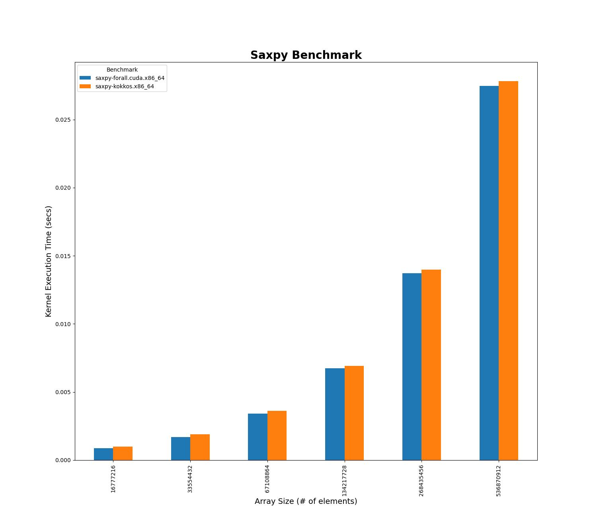

### __Saxpy Addition Benchmark__

This is another simple example of a Saxpy implementation. It is good for a performance regression but also in showing some differences in the Kitsune+Tapir feature set vs. Kokkos.  In particular, Kitsune+Tapir can handle initialized host-side global variables (`const` only) being used
inside parallel loops.  With Kokkos (CUDA) such values may not be initialized at global scope and must also be declared as `__managed__`.

There are two versions of the benchmark:

* `saxpy-forall.cpp`: The Kitsune `forall` implementation.
* `saxpy-kokkos.cpp`: A `DualView` version of the code with `__managed__` global values used within the `parallel_for` constructs.

### __Performance Table and Plot__

<!--- A nice site to convert CSV to MD --
  https://www.convertcsv.com/csv-to-markdown.htm
--->
|Size       |Benchmark               |Time (sec) |
|-----------|------------------------|-----------|
|16,777,216 |saxpy-forall.cuda.x86_64|0.000865   |
|16,777,216 |saxpy-kokkos.x86_64     |0.000993   |
|33,554,432 |saxpy-forall.cuda.x86_64|0.001694   |
|33,554,432 |saxpy-kokkos.x86_64     |0.001905   |
|67,108,864 |saxpy-forall.cuda.x86_64|0.003408   |
|67,108,864 |saxpy-kokkos.x86_64     |0.003628   |
|134,217,728|saxpy-forall.cuda.x86_64|0.006729   |
|134,217,728|saxpy-kokkos.x86_64     |0.006922   |
|268,435,456|saxpy-forall.cuda.x86_64|0.013707   |
|268,435,456|saxpy-kokkos.x86_64     |0.013983   |
|536,870,912|saxpy-forall.cuda.x86_64|0.027473   |
|536,870,912|saxpy-kokkos.x86_64     |0.027828   |

