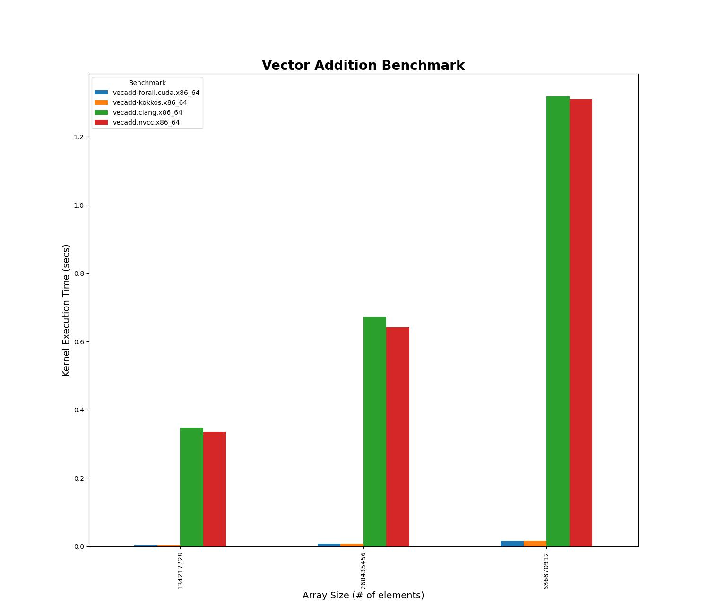

### __Vector Addition Benchmark__

This is a simple example that matches the basic functionality of the vector addition code that is part of the sample programs distributed with CUDA.  It does an *element-by-element* addition of two vectors, saving the result in a third.

There are multiple version of the same benchmark written using different approaches:

* `vecadd.cu`: Is a straight CUDA implementation that uses UVM.  The use of UVM highlights the impact of page faults on overall performance and is not intended to show good practice nor high-performance.
* `vecadd-kokkos.cpp`: A Kokkos implementation that uses a `DualView` to simplify *host-to-device* and *device-to-host* data movement.
* `vecadd-forall.cpp`: A Kitsune-centric implementation that uses the `forall` keyword for the parallel computation.  It is hardcoded to use the Kitsune runtime to allocate a chunk of UVM memory.  In this particular case, Kitsune+Tapir will insert *prefetch* calls that will avoid most page fault issues with this version of `vecadd`.  The difference in performance should be noticeable over the default UVM behaviors of the CUDA version discussed above.

As a benchmark, `vecadd` is not that significant with the one exception being a good path to spot regressions.  While the `forall` version is a reasonable comparison vs. Kokkos, the CUDA version  highlights the challenges of using UVM that the developer does not have to concern themselves with when using `forall`.  The default Kokkos behavior with `DualViews` boils down to explicit *memcpy* calls for *host-to-device* and *device-to-host* data movement.

### __Performance Table and Plot__

<!--- A nice site to convert CSV to MD --
  https://www.convertcsv.com/csv-to-markdown.htm
--->
|Size     |Benchmark                |Time (sec) |
|---------|-------------------------|:------:|
|134217728|vecadd.clang.x86_64      |0.347180|
|134217728|vecadd.nvcc.x86_64       |0.335476|
|134217728|vecadd-kokkos.x86_64     |0.004161|
|134217728|vecadd-forall.cuda.x86_64|0.004025|
|268435456|vecadd.clang.x86_64      |0.672192|
|268435456|vecadd.nvcc.x86_64       |0.642538|
|268435456|vecadd-kokkos.x86_64     |0.008146|
|268435456|vecadd-forall.cuda.x86_64|0.008130|
|536870912|vecadd.clang.x86_64      |1.318844|
|536870912|vecadd.nvcc.x86_64       |1.309608|
|536870912|vecadd-kokkos.x86_64     |0.016318|
|536870912|vecadd-forall.cuda.x86_64|0.016255|

